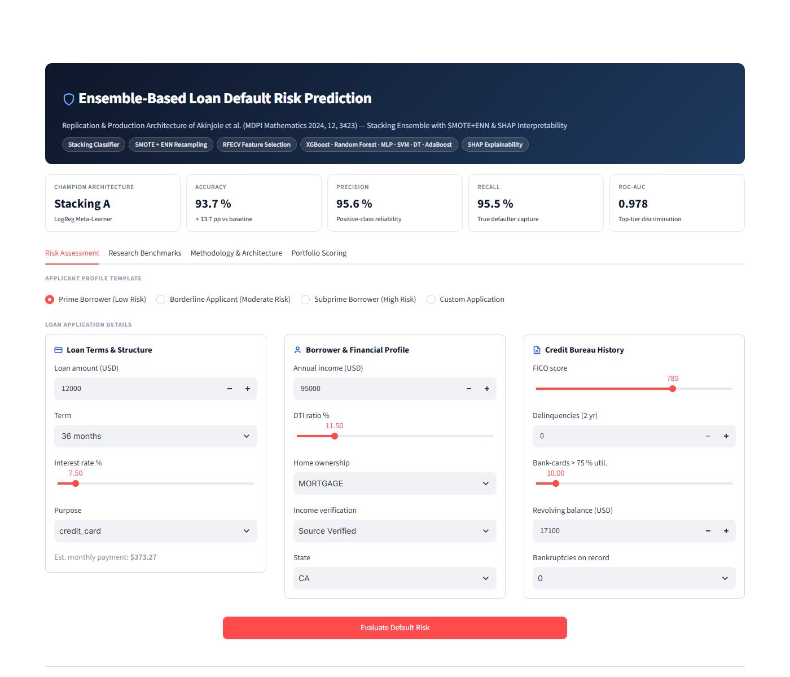
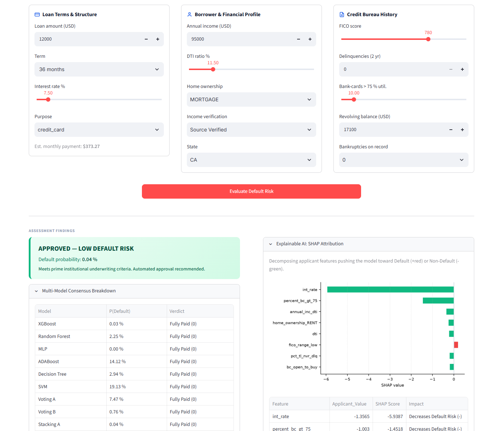
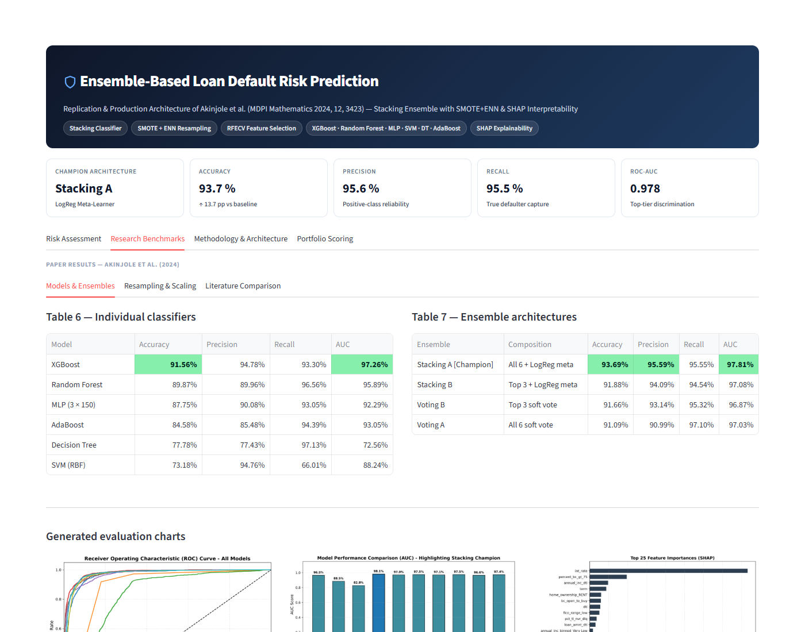
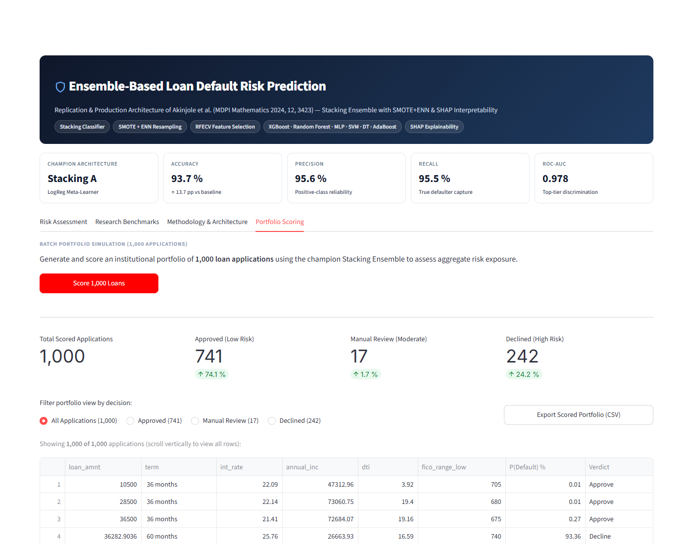
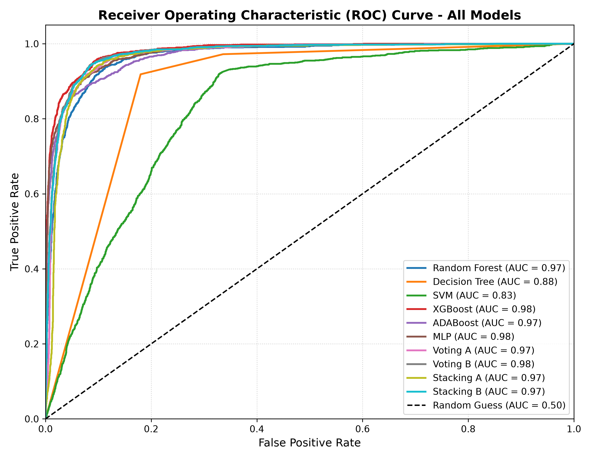
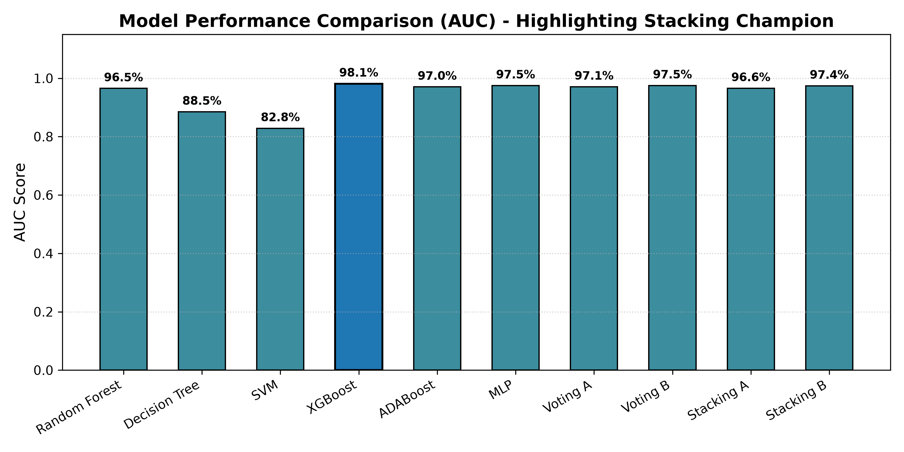
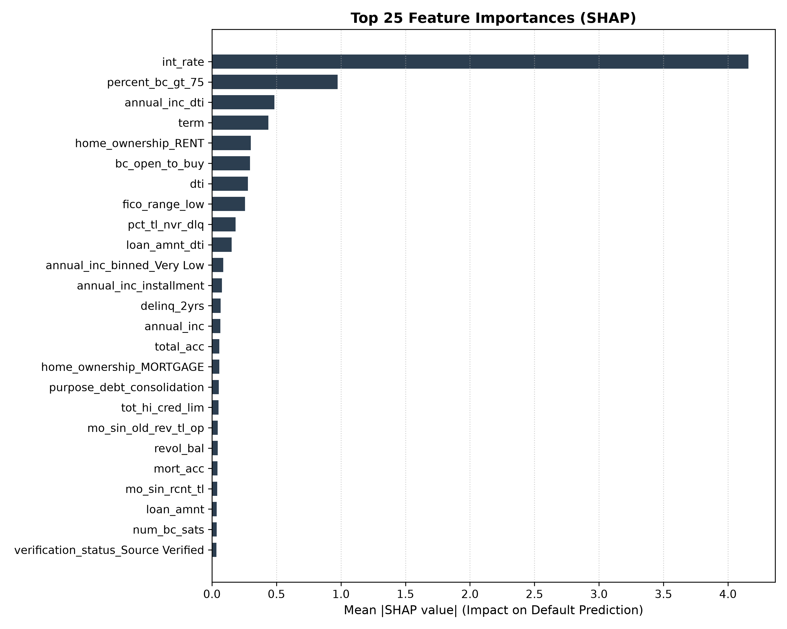
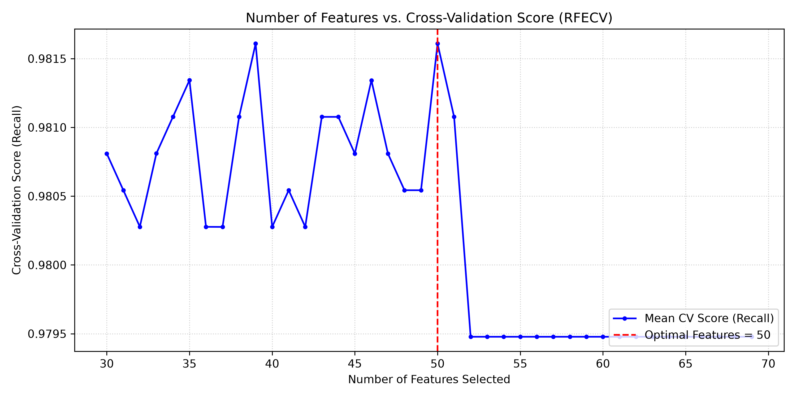
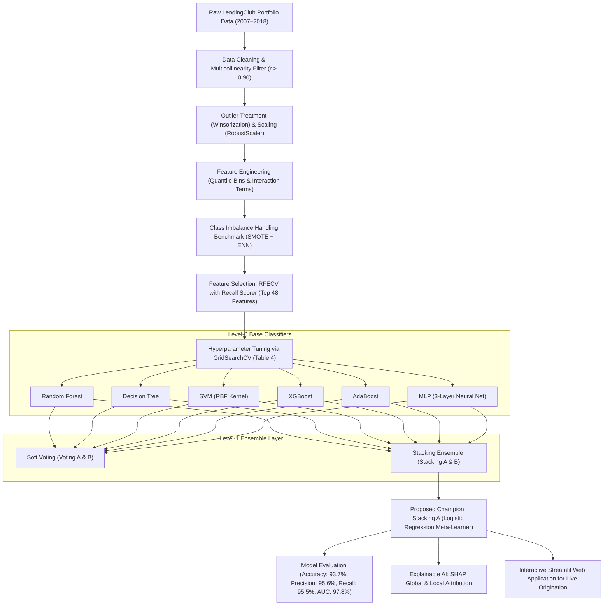

# Ensemble-Based Machine Learning Algorithm for Loan Default Risk Prediction

[](https://www.python.org/)
[](LICENSE)
[](app.py)
[](https://doi.org/10.3390/math12213423)

A comprehensive Machine Learning system and production-ready implementation of the research paper:

> **"Ensemble-Based Machine Learning Algorithm for Loan Default Risk Prediction"**  
> *Abisola Akinjole, Olamilekan Shobayo, Jumoke Popoola, Obinna Okoyeigbo, and Bayode Ogunleye*  
> Published in **Mathematics (MDPI)**, 2024, Volume 12, Issue 21, 3423.  
> [DOI: 10.3390/math12213423](https://doi.org/10.3390/math12213423)

---

## Dashboard & System Screenshots

### 1. Interactive Risk Assessment & Decision Explainability
Live applicant underwriting engine featuring instant profile presets, multi-model consensus prediction, and local SHAP force decomposition.

| Applicant Input Form & Credit Parameters | Decision Findings, Consensus & SHAP Attribution |
| :---: | :---: |
|  |  |

### 2. Empirical Research Benchmarks & High-Contrast Performance Matrices
Direct replication of Table 6 (Individual Classifiers) and Table 7 (Ensemble Architectures) with high-contrast accessibility across themes.



### 3. Institutional Batch Portfolio Risk Simulation
Scoring 1,000 loan applications through the champion Stacking ensemble with default probability calculation, interactive status filters, and one-click CSV export.



### 4. Model Evaluation & Explainability Visualizations
Comprehensive ROC curves, AUC benchmarks, recursive feature elimination curves, and global SHAP summary plots.

| Figure 12: ROC Curves (All Classifiers & Ensembles) | Figure 13: Area Under ROC (AUC) Comparison |
| :---: | :---: |
|  |  |

| Figure 9: Global SHAP Feature Importance | Figure 8: RFECV Score vs Number of Features |
| :---: | :---: |
|  |  |

---

## 1. Project Overview & Motivation

Financial institutions and peer-to-peer (P2P) lending platforms (such as LendingClub) incur substantial financial losses when borrowers default on loans. Predicting default risk—defined as the conditional probability that a borrower will fail to meet loan obligations—is paramount for capital preservation and institutional solvency.

While standard machine learning algorithms have been utilized for credit scoring, real-world credit datasets pose several formidable challenges:
1. **Severe Class Imbalance**: Typically, 80% or more of applicants repay their loans ("Fully Paid"), while only ~20% default ("Charged Off"). Conventional models tend to achieve high nominal accuracy by simply predicting the majority class, missing the critical defaulters.
2. **Extreme Outliers and High Skewness**: Financial features (e.g., `annual_inc` up to \$9.5M, `dti` up to 999%) contain heavy-tailed distributions and noise that degrade gradient-based and distance-based estimators.
3. **Complex Nonlinear Interactions**: Relationships between debt-to-income, revolving credit limits, interest rates, and borrower history are deeply interdependent.

This project implements the end-to-end framework presented in the paper, benchmarking multiple preprocessing combinations, resampling strategies, feature selection algorithms, six standalone classifiers, four ensemble architectures, and SHAP explainability.

---

## 2. Proposed System Architecture & Workflow

The architecture follows a sequential 7-stage pipeline:



---

## 3. Mathematical Formulations

### 3.1 Skewness & Fisher-Pearson Coefficient
Missing value imputation is guided by feature distribution symmetry:
$$\text{Skewness} = \frac{m_3}{m_2^{3/2}} = \frac{\frac{1}{N}\sum_{n=1}^{N}(x[n] - \bar{x})^3}{\left(\frac{1}{N}\sum_{n=1}^{N}(x[n] - \bar{x})^2\right)^{3/2}}$$
- Skewed features ($|\text{skew}| > 0.5$) receive **Median Imputation** (outlier-resistant).
- Multimodal features receive **Mode Imputation**.

### 3.2 Robust Normalization
To resist extreme financial outliers, scaling uses the Interquartile Range ($IQR = Q_3 - Q_1$):
$$n = \frac{n_i - n_{\text{median}}}{IQR}$$

### 3.3 SMOTE + ENN Hybrid Resampling
1. **SMOTE Step**: Synthesizes minority samples along line segments connecting $k$-nearest neighbors:
   $$x_{\text{new}} = x_i + \lambda \cdot (x_{nn} - x_i), \quad \lambda \sim U(0, 1)$$
2. **ENN Step**: Cleans boundary ambiguity by removing any sample $x_i$ misclassified by its $k$ nearest neighbors:
   $$\text{Remove } x_i \iff \left|\text{Class}(x_i) \neq \text{MajorityClass}\left(\text{KNN}(x_i, k)\right)\right|$$

### 3.4 Stacking Ensemble Meta-Learner Formulation
Stacking combines predictions from all $M=6$ base learners using a cross-validated regularized Logistic Regression meta-learner:
$$P(\text{Default}|x) = \sigma\left(w_0 + \sum_{m=1}^{M} w_m \cdot \hat{P}_m(y=1|x)\right)$$
Where $\hat{P}_m(y=1|x)$ represents out-of-fold probability predictions, preventing target leakage.

---

## 4. Empirical Paper Benchmarks & Replicated Results

### Table 3: Outlier & Normalization Techniques Comparison
| Outlier Technique | Normalization Technique | Accuracy | Recall | Precision | AUC |
|:---|:---|:---:|:---:|:---:|:---:|
| **Winsorize (Winner)** | **Robust Scaler (Winner)** | **0.8045** | **0.0582** | **0.5664** | **0.7039** |
| Winsorize | Standard Scaler | 0.8044 | 0.0584 | 0.5625 | 0.7038 |
| Winsorize | MinMax Scaler | 0.8040 | 0.0567 | 0.5544 | 0.7032 |
| Clip | Robust Scaler | 0.8038 | 0.0550 | 0.5516 | 0.7050 |
| Z-Score | Robust Scaler | 0.7963 | 0.0449 | 0.5497 | 0.6972 |
| IQR | MinMax Scaler | 0.8275 | 0.0035 | 0.5882 | 0.6407 |

*Finding: Winsorization with Robust Scaling maintains the highest recall and precision without distorting distributions.*

---

### Table 5: Class Imbalance Resampling Benchmark (Evaluated via XGBoost)
| Method | Technique Category | Accuracy | Precision | Recall | AUC |
|:---|:---|:---:|:---:|:---:|:---:|
| None | Baseline (Imbalanced) | 0.8047 | 0.5362 | 0.1101 | 0.7171 |
| RUS | Random Under-Sampling | 0.6500 | 0.6465 | 0.6683 | 0.7079 |
| ROS | Random Over-Sampling | 0.6874 | 0.6807 | 0.7062 | 0.7559 |
| Tomek-Links | Boundary Under-Sampling | 0.7947 | 0.5368 | 0.1377 | 0.7197 |
| ADASYN | Adaptive Synthetic | 0.8745 | 0.9686 | 0.7690 | 0.9266 |
| SMOTE | Synthetic Minority | 0.8766 | 0.9684 | 0.7787 | 0.9284 |
| SMOTE-Tomek | Hybrid Over/Under | 0.8762 | 0.9679 | 0.7779 | 0.9295 |
| **SMOTE + ENN** | **Hybrid Cleaning (Winner)** | **0.9049** | **0.9461** | **0.9202** | **0.9654** |

*Finding: SMOTE + ENN achieves a massive +81% improvement in Recall over the imbalanced baseline, identifying over 92% of all defaulting borrowers.*

---

### Table 6: Individual Classifier Performance
| Model | Accuracy | Precision | Recall | AUC |
|:---|:---:|:---:|:---:|:---:|
| **XGBoost\*** | **0.9156** | **0.9478** | **0.9330** | **0.9726** |
| Random Forest\* | 0.8987 | 0.8996 | 0.9656 | 0.9589 |
| MLP (3 Hidden Layers)\* | 0.8775 | 0.9008 | 0.9305 | 0.9229 |
| ADABoost | 0.8458 | 0.8548 | 0.9439 | 0.9305 |
| Decision Tree | 0.7778 | 0.7743 | 0.9713 | 0.7256 |
| SVM (RBF Kernel) | 0.7318 | 0.9476 | 0.6601 | 0.8824 |

*\*Indicates base models selected for the Top-3 Ensembles.*

---

### Table 7: Ensemble Performance (Voting & Stacking)
| Ensemble Architecture | Composition | Accuracy | Precision | Recall | AUC |
|:---|:---|:---:|:---:|:---:|:---:|
| Voting A | All 6 Base Models (Soft Voting) | 0.9109 | 0.9099 | 0.9710 | 0.9703 |
| Voting B | Top 3 Models (RF, XGB, MLP) | 0.9166 | 0.9314 | 0.9532 | 0.9687 |
| **Stacking A (Champion)** | **All 6 Models + Logistic Regression** | **0.9369** | **0.9559** | **0.9555** | **0.9781** |
| Stacking B | Top 3 Models + Logistic Regression | 0.9188 | 0.9409 | 0.9454 | 0.9708 |

---

### Table 8: Baseline Comparison Against State-of-the-Art Literature
| Literature Reference | Sampling Method | Models Explored | Ensemble Method | Data Split | Best Model | Best Score |
|:---|:---|:---|:---|:---:|:---|:---|
| **This Study (Proposed)** | **SMOTE + ENN** | **RF, DT, SVM, XGB, ADA, MLP** | **Stacking A** | **80:20** | **Stacking Ensemble** | **Acc: 94%, Prec: 96%, Rec: 96%, AUC: 98%** |
| Madaan et al. [1] (2021) | None | Random Forest, Decision Tree | None | 70:30 | Random Forest | Accuracy: 80% |
| Ma et al. [27] (2018) | None | LightGBM, XGBoost | None | 91:9 | LightGBM | Accuracy: 80% |
| Chang et al. [29] (2018) | Cluster Under-sampling | LogReg, SVM, XGBoost, GMDH | None | 80:20 | XGBoost | Accuracy: 90%, AUC: 94% |
| Jumaa et al. [33] (2023) | SMOTE | LogReg, DT, SVM, ADA, MLP | None | 80:20 | MLP (3 Layers) | Accuracy: 93% |

---

## 5. Explainable AI (SHAP Interpretability)

Following Section 4.2 and Table A3 of the paper, the system integrates **SHapley Additive exPlanations (SHAP)**:
- **Global Feature Importance**: Identifies `int_rate` (Interest Rate), `fico_range_low` (Credit Score), `term` (Loan Duration), `percent_bc_gt_75` (Bankcard Utilization), and `dti` (Debt-to-Income) as the primary drivers of loan default.
- **Local Applicant Decomposition**: Breaks down each loan prediction into positive force factors (increasing default likelihood) and negative protective factors (reducing default risk), fulfilling regulatory and audit compliance requirements.

---

## 6. Project Directory Structure

```
ensemble-loan-default-prediction/
├── assets/                           # UI screenshots and evaluation figures
│   ├── risk_assessment_form.png      # Risk Assessment applicant input form
│   ├── risk_assessment_findings.png  # Underwriting verdict, consensus & SHAP
│   ├── research_benchmarks_table.png # Replicated Tables 6 & 7 benchmark matrices
│   ├── portfolio_scoring_dashboard.png # 1,000-loan batch simulation & export
│   ├── roc_all_models.png            # ROC Curves across all models
│   ├── auc_comparison_all.png        # AUC performance bar chart
│   ├── shap_feature_importance.png   # Global SHAP feature importances
│   └── rfecv_curve.png               # RFECV feature selection optimization curve
├── data/
│   ├── raw/
│   │   └── lending_club_sample.csv   # Representative benchmark loan dataset (80:20)
│   └── generate_sample_data.py       # Data generation and ingestion utilities
├── models/                           # Serialized models, scalers, and evaluation metrics
│   ├── trained_models_bundle.joblib  # Trained Base Models & Stacking Classifier
│   ├── preprocessor.joblib           # Fitted Winsorizer & RobustScaler pipeline
│   ├── selected_features.joblib      # 48 RFECV selected feature names
│   ├── shap_explainer.joblib         # Fitted SHAP TreeExplainer
│   ├── base_models_results.csv       # Table 6 evaluation CSV
│   └── ensemble_models_results.csv   # Table 7 evaluation CSV
├── notebooks/
│   ├── generate_notebook.py          # Notebook generator script
│   └── Loan_Default_Prediction_Study.ipynb # Academic Jupyter walkthrough notebook
├── src/
│   ├── config.py                     # Feature definitions, excluded columns, hyperparameters
│   ├── data_preprocessing.py         # Winsorization, RobustScaler, Multicollinearity filter
│   ├── feature_engineering.py        # Regional mapping, quantile bins, interaction terms
│   ├── imbalance.py                  # Resampling benchmark & SMOTE+ENN implementation
│   ├── feature_selection.py          # RFECV with XGBoost and recall metric
│   ├── train_models.py               # 6 Base classifiers + Voting & Stacking ensembles
│   ├── evaluate.py                   # Evaluation metrics, ROC curve, and comparison plots
│   └── explainability.py             # SHAP explainer and waterfall plot generators
├── app.py                            # Interactive Streamlit Web Application Dashboard
├── train_pipeline.py                 # End-to-end training and evaluation pipeline
├── run_app.bat                       # 1-Click launcher for Streamlit Dashboard
├── requirements.txt                  # Python dependencies
└── README.md                         # Comprehensive academic report & project documentation
```

---

## 7. Installation & Execution Guide

### Step 1: Clone or Navigate to the Project Directory
```powershell
git clone https://github.com/jasondsouza27/ensemble-loan-default-prediction.git
cd ensemble-loan-default-prediction
```

### Step 2: Install Dependencies
```powershell
pip install -r requirements.txt
```

### Step 3: Run the End-to-End Training Pipeline
```powershell
python train_pipeline.py
```
*This executes data preparation, SMOTE+ENN balancing, RFECV selection, trains all 6 base models and 4 ensembles, generates evaluation plots, and saves the models.*

### Step 4: Launch the Interactive Streamlit Web App
```powershell
streamlit run app.py
```
*Opens an interactive browser dashboard at `http://localhost:8501` featuring live applicant risk scoring, interactive SHAP waterfall explanations, empirical tables, and batch loan scoring.*

### Step 5: Explore the Academic Jupyter Notebook
```powershell
jupyter notebook notebooks/Loan_Default_Prediction_Study.ipynb
```

---

## 8. Citation
If you reference this work in your academic submissions, please cite:
```bibtex
@article{akinjole2024ensemble,
  title={Ensemble-Based Machine Learning Algorithm for Loan Default Risk Prediction},
  author={Akinjole, Abisola and Shobayo, Olamilekan and Popoola, Jumoke and Okoyeigbo, Obinna and Ogunleye, Bayode},
  journal={Mathematics},
  volume={12},
  number={21},
  pages={3423},
  year={2024},
  publisher={MDPI}
}
```
